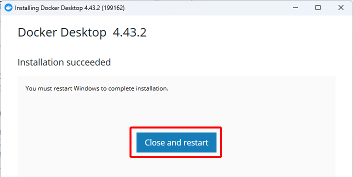
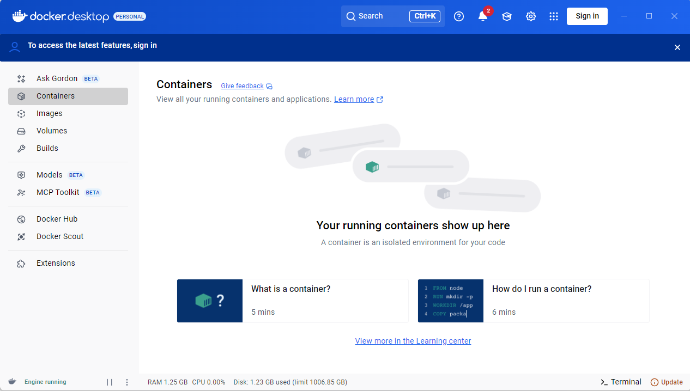

# Docker Desktop のインストールとセットアップ

Docker を使用するにはいくつかの方法がありますが、ここでは Windows、macOS 向けに用意されている Docker Desktop を利用する方法で説明します。

なお、Docker Desktop は個人の開発者が勉強で使用する分には無料ですが、従業員 250 人以上、または年間売上 1000 万ドル以上の企業で使用する場合は有料になります。

最新情報は以下で確認できます。

https://www.docker.com/ja-jp/pricing/

## Windows での必須要件

Windows の必須要件は以下の通りです。

・Windows 10 の場合：64bit 版の Pro/Enterprise/Education/Home エディションの 22H2（ビルド 19045）以降のバージョン。

・Windows 11 の場合：64bit 版の Pro/Home エディションの 22H2 以降のバージョン。

以下は Windows 10／11 共通の要件です。

・WSL2 が使用できること
・BIOS/UEFI でハードウェア仮想化に対応していること
・メモリが 4GB 以上であること
・CPU は SLAT 機能をサポートした 64 ビットプロセッサであること

要件は変更になることがあります。最新情報は以下で確認できます。

https://docs.docker.jp/desktop/install/windows-install.html

## macOS での必須要件

macOS の必須要件は以下の通りです。

・macOS の最新メジャーリリースまたは過去 2 つのメジャーリリースを使用していること
・メモリ 4GB 以上

要件は変更になることがあります。最新情報は以下で確認できます。

https://docs.docker.jp/desktop/install/mac-install.html

## インストーラーをダウンロードする

Windows 向け、macOS 向け、どちらのツールも Docker 公式サイトからダウンロードできます。

以下のページにアクセスして、ページ中央の「Docker Desktop をダウンロードする」をクリックしてください。

https://www.docker.com/ja-jp/products/docker-desktop/

自分の環境にあったインストーラーをダウンロードします。Windows 向けは「AMD64」か「ARM64」か、macOS 向けは「Apple Silicon」か「Intel チップ」かでダウンロードするインストーラーが異なります。

Windows では、画面左下の検索ボックスで「システム情報」を検索して、「システム情報」の画面を開きます。左側で「システムの要約」を選び、右側の「システムの種類」を選び、「x64」となっていたら「AMD64」のインストーラーを選びます。「ARM64」となっていたら「ARM64」のインストーラーを選びます。

macOS では、画面左上のリンゴマークをクリックして、「この Mac について」を選び、開いた画面で「プロセッサ」を確認します。「Apple M1」など「Apple」の文字が入っていれば「Apple Silicon」のインストーラーを選び、「Intel」の文字が入っていれば「Intel チップ」のインストーラーを選びます。

## Windows でのインストール

ダウンロードしたインストーラーをダブルクリックして実行します。

インストーラーの画面が表示されます。最初の画面では 2 か所にチェックが入っている状態ですが、このままにして「OK」をクリックします。

インストールが完了したら、「Close and restart」をクリックして PC を再起動します。

再起動すると、利用規約への同意を求める図のような画面が表示されます。必要に応じて左下の「View Full Terms」をクリックして内容を確認して、問題なければ「Accept」をクリックします。

次の画面ではアカウントの作成やサインインを求められます。スキップする場合は右上の「Skip」をクリックします。

すべてのインストールが終わったらこの画面が表示されます。この画面が出たら、〇章で記載のある「docker compose up」コマンドの実行準備が整ったと考えて OK です。
「docker compose up」でコンテナの作成が成功したら、この「Containers」の画面に、コンテナが表示されます。

## macOS でのインストール

ダウンロードした「docker.dmg」をダブルクリックして、インストール用の画面を開きます。画面の指示に従って、「docker」のアイコンを「Applications」にドラッグするとインストールが始まります。

インストールが終わると図の画面が表示されます。必要に応じて左下の「View Full Terms」をクリックして内容を確認して、問題なければ「Accept」をクリックします。

次の画面では特に設定にこだわりがなければ、上のボタンが選択されている状態のまま「Finish」をクリックしましょう。

次の画面ではアカウントの作成やサインインを求められます。スキップする場合は右上の「Skip」をクリックします。

すべてのインストールが終わったらこの画面が表示されます。この画面が出たら、〇章で記載のある「docker compose up」コマンドの実行準備が整ったと考えて OK です。
「docker compose up」でコンテナの作成が成功したら、この「Containers」の画面に、コンテナが表示されます。

## Docker Desktop の終了と再起動

Docker Desktop はタスクトレイに常駐しています。使用しないときはタスクトレイのクジラアイコンを右クリックして「Quit Docker Desktop」を選択して終了しましょう。

起動する場合は、Windows の場合はスタートメニューで「Docker Desktop」を選びます。macOS の場合は「Application」フォルダの「Docker.app」をクリックして起動しましょう。

